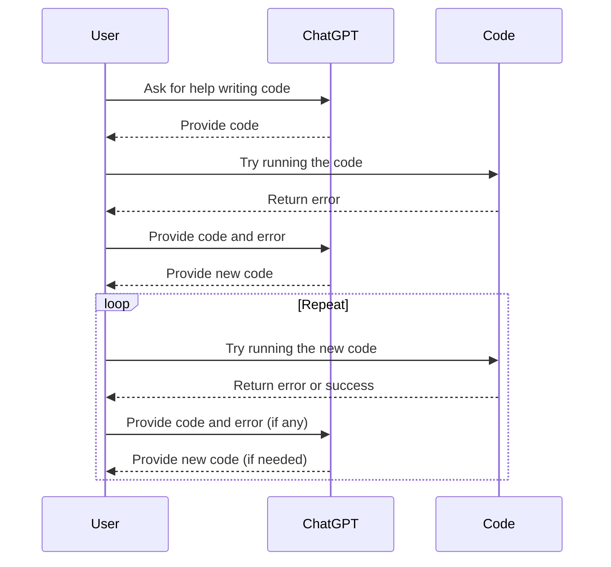

```mermaid
sequenceDiagram
    participant User
    participant ChatGPT
    participant Code

    User->>ChatGPT: Ask for help writing code
    ChatGPT-->>User: Provide code
    User->>Code: Try running the code
    Code-->>User: Return error
    User->>ChatGPT: Provide code and error
    ChatGPT-->>User: Provide new code
    loop Repeat
        User->>Code: Try running the new code
        Code-->>User: Return error or success
        User->>ChatGPT: Provide code and error (if any)
        ChatGPT-->>User: Provide new code (if needed)
    end
```
