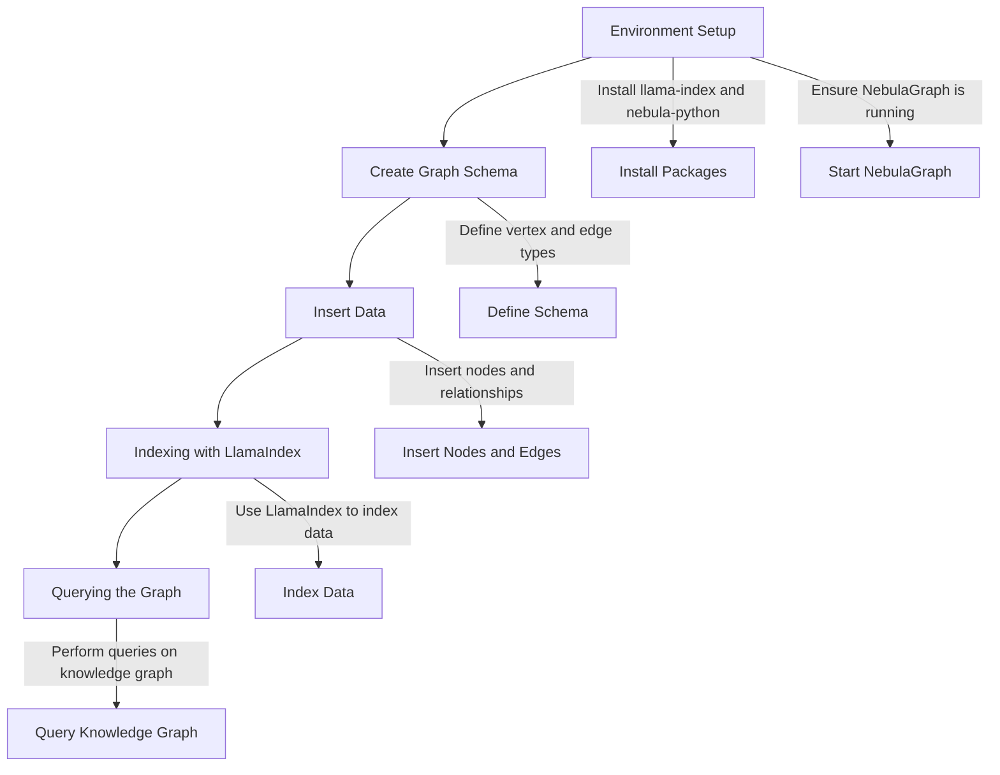

```mermaid
graph TD
    A[Environment Setup] --> B[Create Graph Schema]
    B --> C[Insert Data]
    C --> D[Indexing with LlamaIndex]
    D --> E[Querying the Graph]

    A --> |Install llama-index and nebula-python| F1[Install Packages]
    A --> |Ensure NebulaGraph is running| F2[Start NebulaGraph]

    B --> |Define vertex and edge types| G1[Define Schema]

    C --> |Insert nodes and relationships| H1[Insert Nodes and Edges]

    D --> |Use LlamaIndex to index data| I1[Index Data]

    E --> |Perform queries on knowledge graph| J1[Query Knowledge Graph]
```
