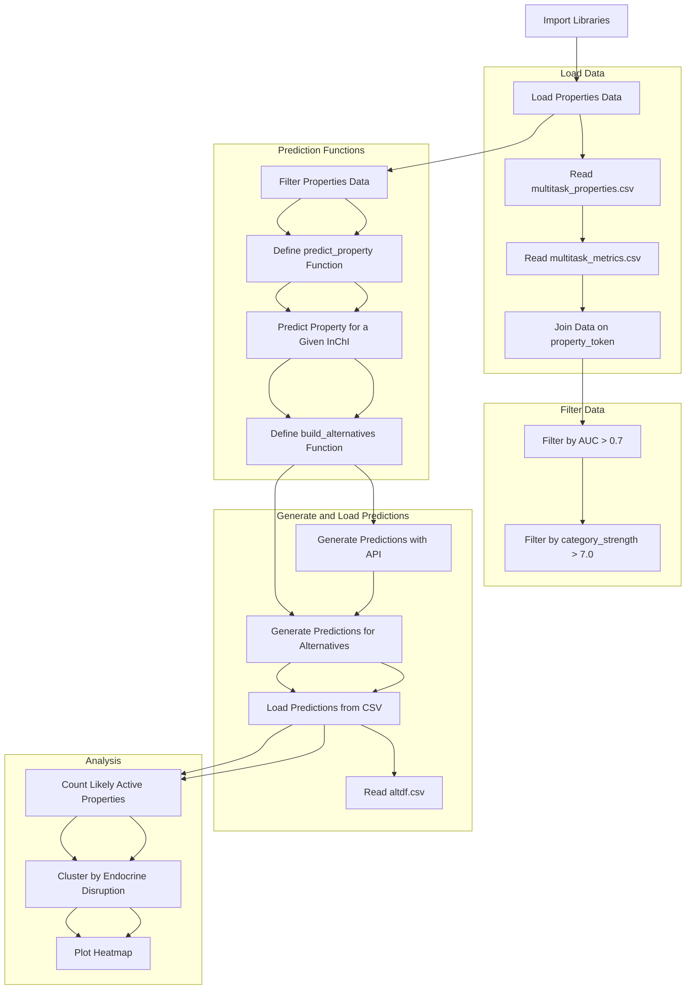

```mermaid

graph TB
    A[Import Libraries] --> B[Load Properties Data]
    B --> C[Filter Properties Data]
    C --> D[Define predict_property Function]
    D --> E[Predict Property for a Given InChI]
    E --> F[Define build_alternatives Function]
    F --> G[Generate Predictions for Alternatives]
    G --> H[Load Predictions from CSV]
    H --> I[Count Likely Active Properties]
    I --> J[Cluster by Endocrine Disruption]
    J --> K[Plot Heatmap]

    subgraph Load Data
        B --> B1[Read multitask_properties.csv]
        B1 --> B2[Read multitask_metrics.csv]
        B2 --> B3[Join Data on property_token]
    end

    subgraph Filter Data
        B3 --> C1[Filter by AUC > 0.7]
        C1 --> C2[Filter by category_strength > 7.0]
    end

    subgraph Prediction Functions
        C --> D
        D --> E
        E --> F
    end

    subgraph Generate and Load Predictions
        F --> F1[Generate Predictions with API]
        F1 --> G
        G --> H
        H --> H1[Read altdf.csv]
    end

    subgraph Analysis
        H --> I
        I --> J
        J --> K
    end
```
